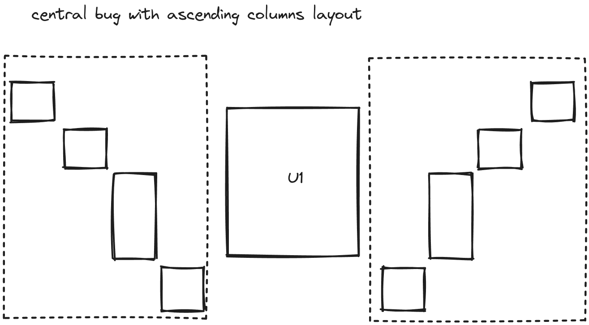
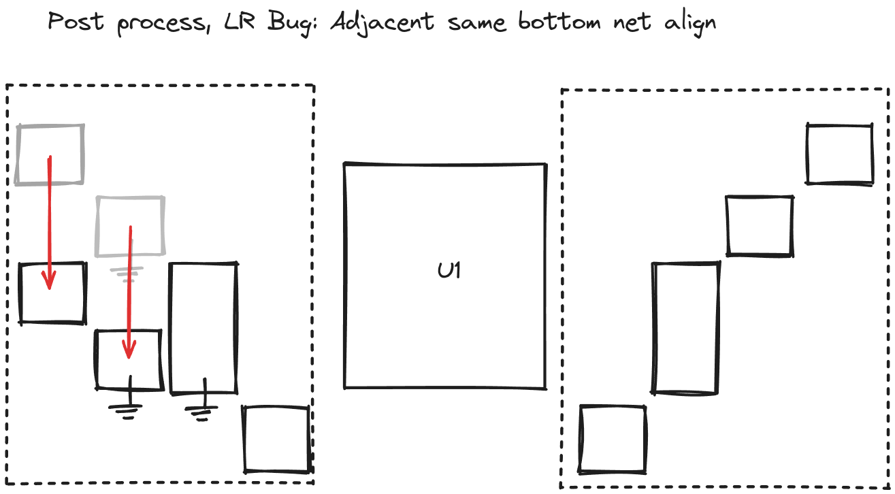

# @tscircuit/autolayout

Algorithms for automatic layout PCBs and Schematics

For routing algorithms, see [@tscircuit/routing](https://github.com/tscircuit/routing)

## Work In Progress

## Main Layout

The main autolayout algorithm we're working on currently focuses on schematic
layout and determines which of the following scenarios is the best fit:

1. Row layout (a simple row, e.g. multiple passives)
2. Column layout (a simple column, e.g. multiple passives)
3. Central LR bug with ascending columns

## Post-layout Processing

In this stage, ports are aligned for the layout is adjusted for general orderly-ness.

1. Port alignment
2. Central LR Bug Only: Shift columns downward where the adjacent colum has the
   same bottom net

